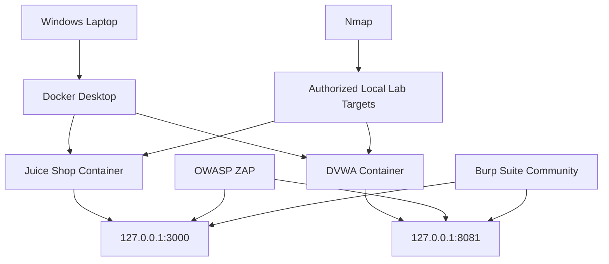

# Aegis Shield — Lab Architecture

```mermaid
flowchart TD
    A[Windows Laptop] --> B[Docker Desktop]
    B --> C[Juice Shop Container]
    B --> D[DVWA Container]
    C --> E[127.0.0.1:3000]
    D --> F[127.0.0.1:8081]
    G[OWASP ZAP] --> E
    G --> F
    H[Burp Suite Community] --> E
    H --> F
    I[Nmap] --> J[Authorized Local Lab Targets]
    J --> C
    J --> D
```

## Isolation
Both web applications are published on the laptop's loopback interface (`127.0.0.1`). They should not be exposed to the internet or shared network.